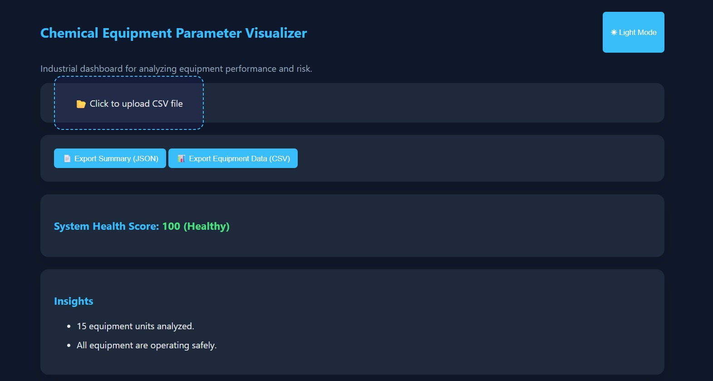
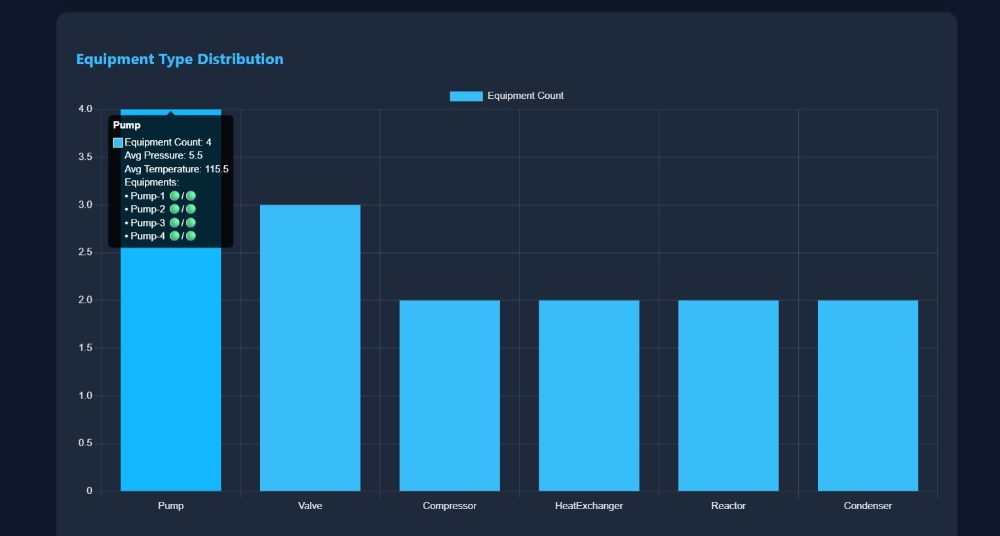
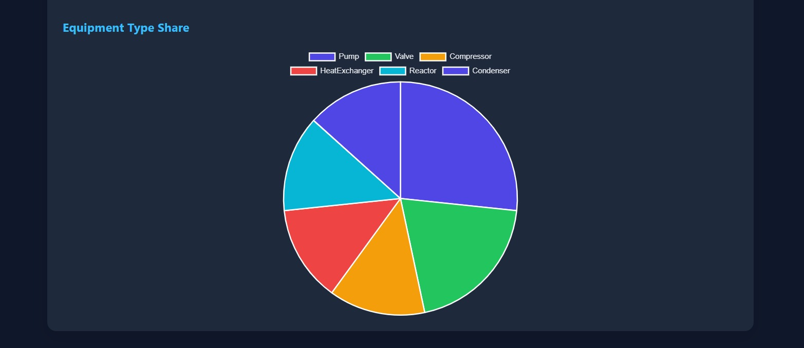
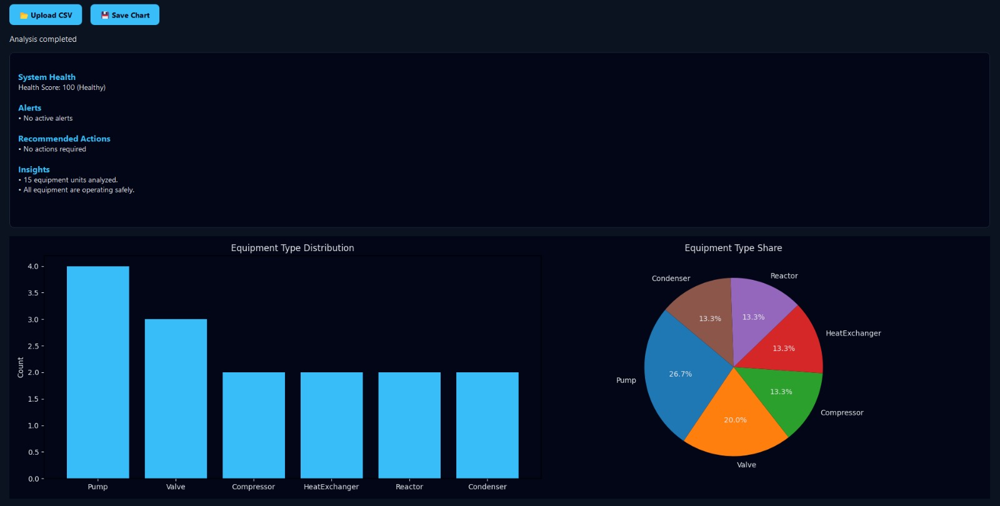
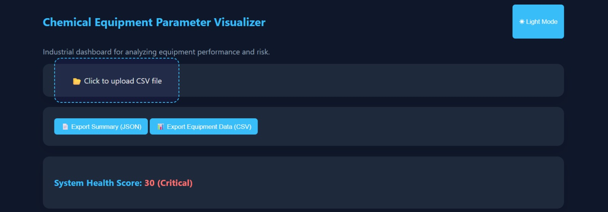
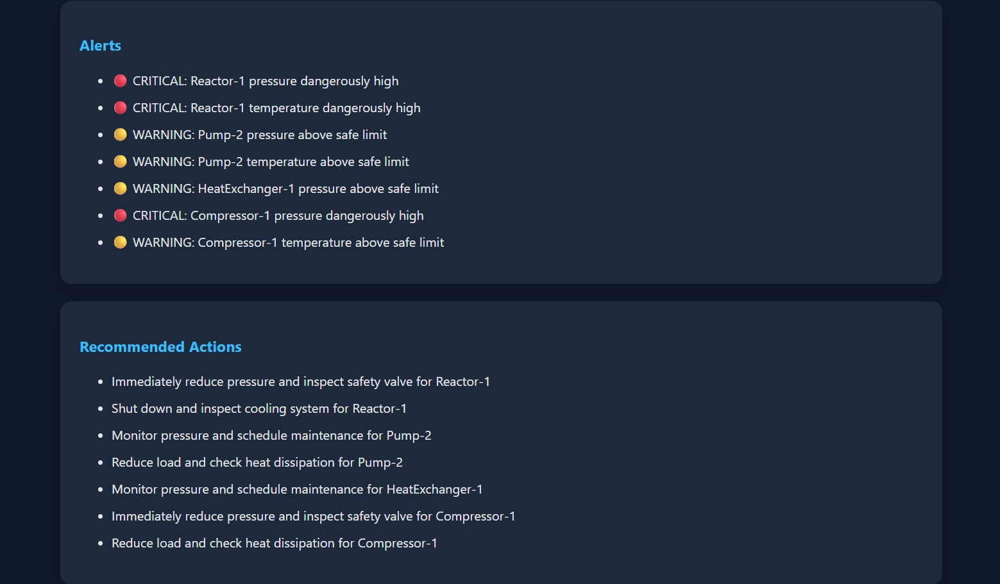
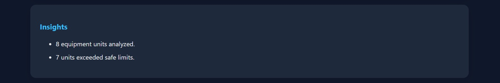
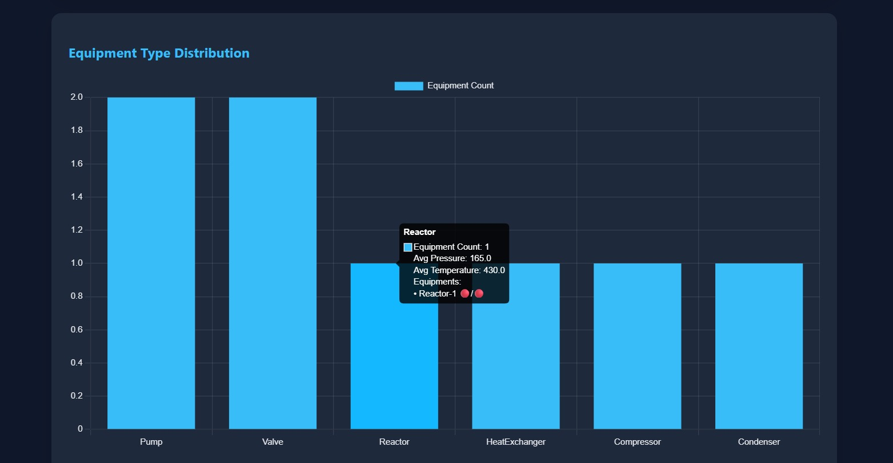
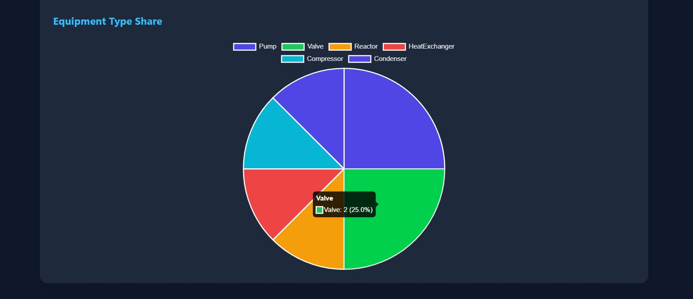

# Chemical Equipment Parameter Visualizer

An industrial dashboard to analyze chemical equipment performance using CSV data.

## Project Overview

This project simulates an industrial monitoring system used in chemical plants
to analyze equipment health, detect abnormal behavior, and recommend corrective actions.

## Key Engineering Highlights

- Threshold-based risk detection (pressure & temperature)
- Health score calculation for overall system status
- Actionable recommendations for operators
- Interactive visual analytics (bar, line charts)
- Dark/Light industrial dashboard UI
- Exportable insights for reporting (CSV / JSON)

## Tech Stack

- Frontend : React + Chart.js (Visualization & UI)
- Backend : Django REST Framework (API & analytics)
- Data Processing : Pandas for analytics (health scoring & insights)

## Application Screenshots

### Web Application





### Desktop Application



## Setup Instructions

## Backend Setup (Django)

```bash
cd backend
python -m venv venv
source venv/bin/activate
pip install -r requirements.txt
python manage.py migrate
python manage.py runserver
```

## Web Frontend Setup (React)

### Install Dependencies

```bash
cd frontend
npm install
```

## Desktop Application Setup (PyQt5)

The desktop application provides an offline industrial dashboard with the same
analytics, charts, and insights as the web frontend.

### Prerequisites

- Python 3.9+
- Virtual environment (recommended)
- Backend API running locally

### Setup Steps

1. Navigate to the desktop app directory:
   ```bash
   cd desktop-app
   ```
2. Create and activate virtual environment:
   python -m venv venv
   source venv/bin/activate # macOS / Linux
   venv\Scripts\activate # Windows
3. Install required dependencies:
   pip install pyqt5 matplotlib requests
4. Start backend server (from project root):
   python manage.py runserver
5. Run the desktop application:
   python main.py

## Demo & Live Links

##  Project Demo Video

A full walkthrough of the web and desktop applications using **demo risky data**:

👉 https://drive.google.com/file/d/1B1GTclSOiHb9SCn5IbD9S7d5Rg7I0BvW/view?usp=sharing

### Live Web Application

Access the deployed web dashboard:  
 **Live URL (Netlify):** https://your-project-name.netlify.app

> Note: Backend API must be running locally or hosted for full functionality.

## Demo Risky Data Simulation

To demonstrate realistic industrial behavior, this project includes a **deliberately crafted demo CSV dataset**
containing **risky operating conditions**.

### Demo Risky CSV File

**Download Demo Risky Dataset:**  
[demo_risky_equipment_data.csv](demo_risky_equipment_data.csv)

_(Used for testing alerts, health scoring, and recommendations)_

### What This Demonstrates

The demo dataset intentionally contains:

- Pressure values exceeding safe operational thresholds
- Temperature values above recommended operating limits
- Equipment operating near or beyond critical conditions

These values are **intentionally introduced** to validate:

- System health score degradation
- Warning & critical alert generation
- Recommended corrective actions
- Outlier detection and root-cause hints

### Why This Is Important

✔ Proves analytics logic works under abnormal conditions  
✔ Demonstrates real-world engineering scenarios  
✔ Shows decision-support capability, not just visualization  
✔ Makes the dashboard meaningful and realistic

### Example Risk Scenarios Included

- Simulated valve blockage causing high pressure
- Cooling system inefficiency leading to overheating
- Equipment-specific anomalies for outlier detection

> **Disclaimer:**  
> The demo risky dataset is created **strictly for demonstration and evaluation purposes**  
> and does **not represent actual plant data or operating conditions**.

### Web Dashboard Output (After Uploading Demo Risky Data)

The screenshot below shows the **web application state after uploading the demo risky CSV file**, highlighting:

- Degraded system health score
- Generated alerts & warnings
- Recommended corrective actions
- Visual impact on charts due to abnormal data






